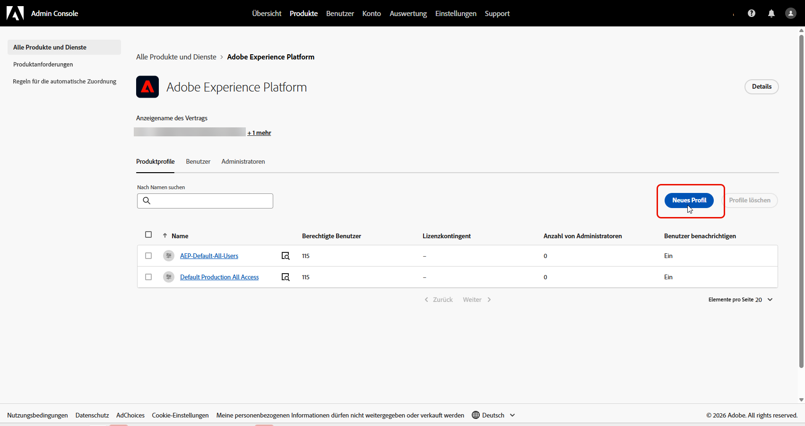
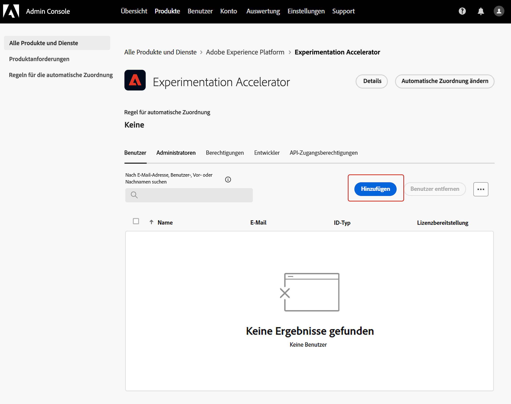

# Zugreifen auf Journey Optimizer Experimentation Accelerator

Nachdem Sie [Ihr Experiment erstellt und konfiguriert](https://experienceleague.adobe.com/de/docs/journey-optimizer/using/content-management/content-experiment/content-experiment) und Ihre Kampagnen oder Journeys an Ihre Profile gesendet haben, können Sie auf **[!UICONTROL Journey Optimizer Experimentation Accelerator]** zugreifen, um sich eingehender mit der Leistung Ihres Experiments zu befassen.

Der Zugriff auf **[!UICONTROL Journey Optimizer Experimentation Accelerator]** erfolgt entweder über das Menü links mit der Dropdown-Liste [!UICONTROL Experimente] oder über den Anwendungsschalter. Beachten Sie, dass Benutzende, die nur eine Target-Lizenz haben, ausschließlich über den Anwendungsschalter darauf zugreifen können.

Die verfügbaren Experimente hängen von Ihrem Setup ab:

* **Für Benutzende, die Adobe Journey Optimizer verwenden**: Experimente, die in der Sandbox Ihrer aktivierten Organisation eingerichtet wurden, werden automatisch einbezogen.

* **Für Benutzende, die Adobe Target mit Journey Optimizer verwenden**: Alle A/B-Aktivitäten in Target werden in **[!UICONTROL Journey Optimizer Experimentation Accelerator]** in der Produktions-Sandbox von Journey Optimizer angezeigt.

* **Für Benutzende, die nur Adobe Target verwenden**: Alle A/B-Aktivitäten in Ihrer Zielorganisation sind in der Produktions-Sandbox von Journey Optimizer enthalten.

Um **[!UICONTROL Journey Optimizer Experimentation Accelerator]** verwenden zu können, benötigen Sie Zugriff auf die Sandbox und die folgende zugehörige Berechtigung:

* **[!UICONTROL Experimente anzeigen]**
* **[!UICONTROL Metadaten zu Experimenten verwalten]**

+++ Erfahren Sie, wie Sie experimentbezogene Berechtigungen mit einer Adobe Experience Platform- oder Adobe Journey Optimizer-Lizenz zuweisen

1. Navigieren Sie im Produkt **[!DNL Permissions]** zur Registerkarte **[!UICONTROL Rollen]** und wählen Sie die gewünschte **[!UICONTROL Rolle]** aus.

1. Klicken Sie auf **[!UICONTROL Bearbeiten]**, um die Berechtigungen zu ändern.

1. Fügen Sie die Ressource **[!UICONTROL Experimentation Accelerator]** hinzu und wählen Sie dann **[!UICONTROL Experimente anzeigen]** und/oder **[!UICONTROL Metadaten zu Experimenten verwalten]** aus dem Dropdown-Menü aus.

   

1. Klicken Sie auf **[!UICONTROL Speichern]**, um die Änderungen anzuwenden.

Die Berechtigungen aller Benutzenden, die dieser Rolle bereits zugewiesen sind, werden automatisch aktualisiert.

So weisen Sie diese Rolle neuen Benutzenden zu:

1. Navigieren Sie zur Registerkarte **[!UICONTROL Benutzende]** in Ihrem Rollen-Dashboard und klicken Sie auf **[!UICONTROL Benutzerin oder Benutzer hinzufügen]**.

1. Geben Sie den Namen und die E-Mail-Adresse der Benutzerin oder des Benutzers ein oder wählen Sie aus der Liste aus und klicken Sie dann auf **[!UICONTROL Speichern]**.

   Wenn die Benutzerin bzw. der Benutzer vorher noch nicht erstellt wurde, lesen Sie [diese Dokumentation](https://experienceleague.adobe.com/de/docs/experience-platform/access-control/abac/permissions-ui/users).

Die Benutzerin oder der Benutzer erhält eine E-Mail mit Anweisungen zum Zugriff auf Ihre Instanz.

+++

 

+++ Erfahren Sie, wie Sie mit der Adobe Target-Lizenz experimentbezogene Berechtigungen zuweisen

1. Öffnen Sie die **[Admin Console](http://adminconsole.adobe.com/)**.

1. Wählen Sie **[!UICONTROL Produkte]** die Option **[!UICONTROL Adobe Experience Platform]**.

1. Klicken Sie auf **[!UICONTROL Neues Profil]**.

   

1. Geben Sie **[!UICONTROL Name]** und **[!UICONTROL Beschreibung]** für das Profil ein und klicken Sie dann auf **[!UICONTROL Speichern]**.

1. Öffnen Sie das neu erstellte **[!UICONTROL Profil]** und navigieren Sie zur Registerkarte **[!UICONTROL Berechtigungen]** .

1. Klicken Sie  neben der Berechtigung **[!UICONTROL Experimentier-Beschleuniger]**.

   

1. Fügen Sie die Berechtigungen hinzu, über die dieses Profil verfügen soll, z **[!UICONTROL B. &quot;]** anzeigen“ und **[!UICONTROL Experimentmetadaten verwalten]** und klicken Sie dann auf **[!UICONTROL Speichern]**.

   >[!TIP]
   >
   > Erstellen Sie separate Profile, wenn Benutzende unterschiedliche Zugriffsebenen benötigen. Erstellen Sie beispielsweise ein **[!UICONTROL Experimentation Accelerator Viewer]**-Profil mit nur **[!UICONTROL Experimente anzeigen]** und ein **[!UICONTROL Experimentation Accelerator Editor]**-Profil mit **[!UICONTROL Experimente anzeigen]** und **[!UICONTROL Experimentmetadaten verwalten]**.

   

1. Wählen Sie auf **[!UICONTROL Registerkarte]** die Option **[!UICONTROL Sandboxes]** aus.

1. Fügen Sie die Sandboxes hinzu, in denen Benutzer Journey Optimizer Experimentation Accelerator verwenden können sollen, und klicken Sie dann auf **[!UICONTROL Speichern]**.

1. Öffnen Sie die Registerkarte **[!UICONTROL Benutzer]** und klicken Sie auf **[!UICONTROL Benutzer hinzufügen]**.

   

1. Fügen Sie die Benutzer hinzu, die diesen Zugriff erhalten sollen, und klicken Sie dann auf **[!UICONTROL Speichern]**.

Benutzende, die zu diesem Profil hinzugefügt wurden, können jetzt über den App Switcher auf Journey Optimizer Experimentation Accelerator zugreifen.

+++

<!--table style="table-layout:fixed"><tr style="border: 0;">
<td>

<strong><a href="experiment-accelerator-overview.md">Overview</a></strong>

</td>
<td>

<strong><a href="experiment-accelerator-monitor.md">Experiments</a></strong>

</td>
<td>

<strong><a href="experiment-accelerator-metrics.md">Metrics</a></strong>

</td>
</tr></table-->
