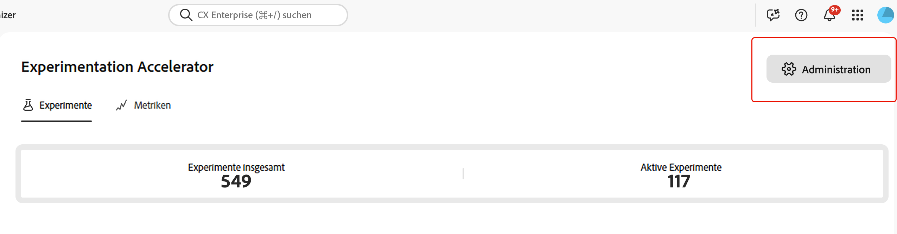
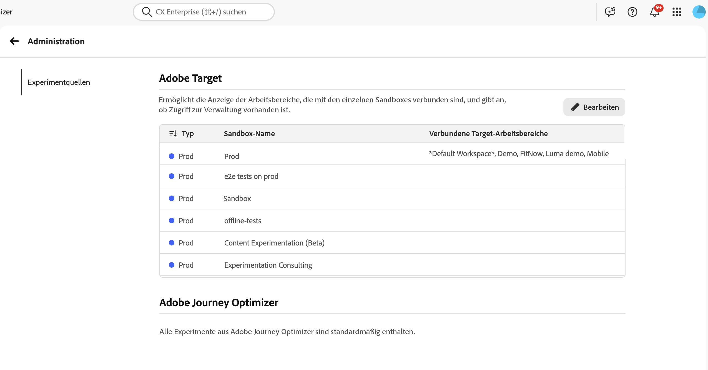
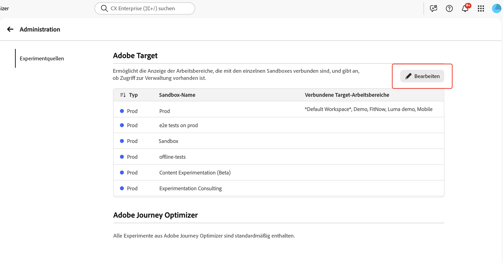
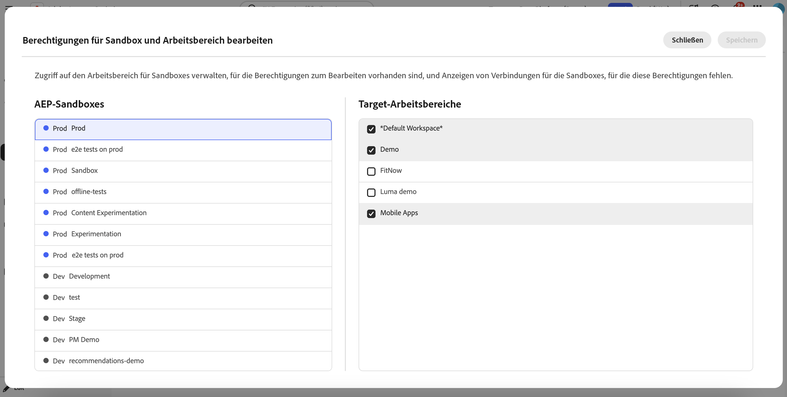

# Integrieren von [!DNL Target] mit Experimentation Accelerator

Experimentation Accelerator hilft Admins bei der Verwaltung der Organisation und Anzeige von [!DNL Adobe Target] Workspace-Aktivitäten in der Anwendung. Durch die Zuordnung jedes [!DNL Target] Arbeitsbereichs zur entsprechenden Experimentation Accelerator-Sandbox können Teams Experimente aus [!DNL Adobe Target] und [!DNL Adobe Journey Optimizer] an einem Ort anzeigen.

➡️ [Erfahren Sie mehr über Adobe Experimentation Accelerator](https://experienceleague.adobe.com/de/docs/experimentation-accelerator/using/overview)

## Voraussetzungen

Bevor Sie Sandbox-Zuweisungen einrichten, überprüfen Sie, ob Sie über die erforderlichen Berechtigungen verfügen. Für den Zugriff **[!UICONTROL Administration]** in Experimentation Accelerator benötigen Sie die Berechtigung **[!UICONTROL Konfiguration verwalten]**.

Benutzer können Sandboxes nur dann [!DNL Target] Arbeitsbereiche zuweisen, wenn beide Bedingungen erfüllt sind:

* Der Benutzer hat die Berechtigung **[!UICONTROL Konfiguration verwalten]** in Experimentation Accelerator.
* Der Benutzer ist [!DNL Target] Produktadministrator.

## Einrichten der Sandbox-Zuweisung für [!DNL Target] Arbeitsbereiche

Beachten Sie vor der Zuweisung von Arbeitsbereichen, dass [!DNL Target] Arbeitsbereich nur einer Sandbox zugewiesen werden kann, um doppelte Einträge für denselben Test zu vermeiden.

So wählen Sie aus, in welcher Sandbox die einzelnen [!DNL Target] Arbeitsbereiche angezeigt werden:

1. Öffnen Sie in Experimentation Accelerator **[!UICONTROL Administration]**.

   

1. Überprüfen Sie die Tabelle der aktuellen [!DNL Target] Arbeitsbereich-zu-Sandbox-Zuweisungen.

   

1. Klicken Sie auf **[!UICONTROL Bearbeiten]**.

   

1. Weisen Sie jeder Sandbox die entsprechenden [!DNL Target] Arbeitsbereiche zu.

   

1. Klicken Sie auf **[!UICONTROL Speichern]**, um Ihre Änderungen anzuwenden.

Warten Sie nach der Erstellung der ersten Verbindung für einen [!DNL Target] Arbeitsbereich bis zu 30 Minuten, bis die Aktualisierungen im System verteilt sind.
