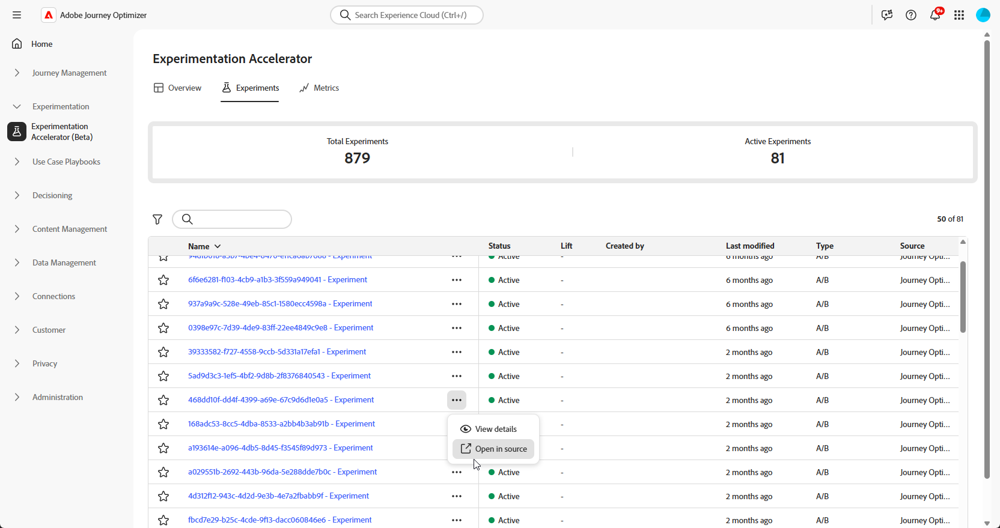
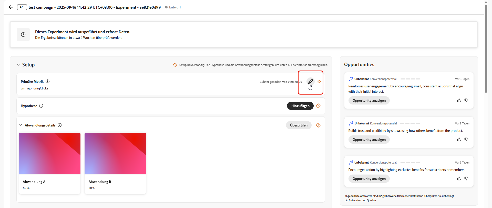
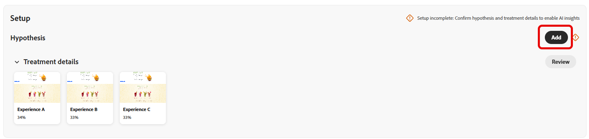
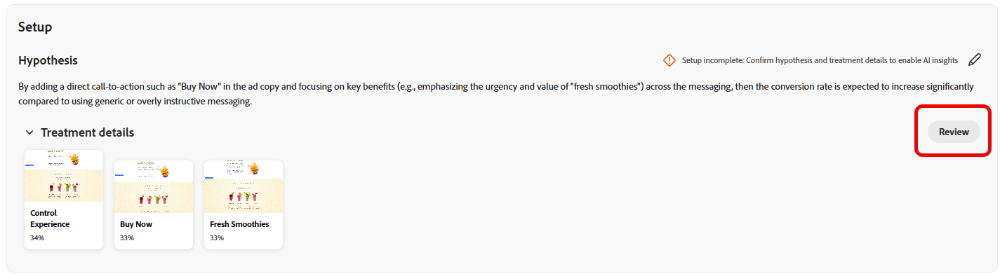
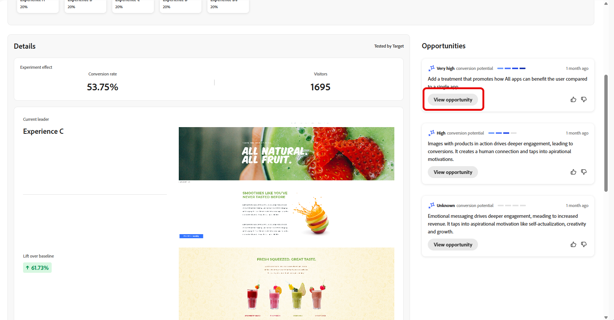
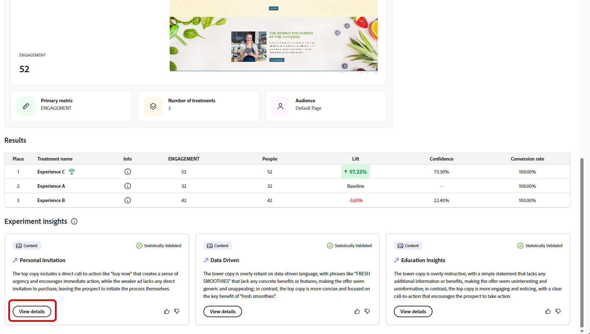

# Verfolgen von Experimenten {#monitor}

Auf der Registerkarte **[!UICONTROL Experimente]** werden das Tracking und die Analyse von Tests aus Adobe Journey Optimizer und Adobe Target zentral zusammengefasst. Sie können alle Experimente anzeigen, KPIs überprüfen und spezifische Tests filtern oder suchen.

## Dashboard {#dashboard}

Beim Zugriff auf die Registerkarte „Experimente“ werden alle verfügbaren Experimente aus Journey Optimizer und Adobe Target in einer konsolidierten Ansicht aufgelistet. Auf diese Weise können Sie Experimente auf beiden Plattformen an einem Ort schnell überprüfen und vergleichen.
Die Liste „Experimente“ enthält:

* Journey Optimizer-Experimente, die entweder in Kampagnen oder Journeys erstellt wurden.

* In der standardmäßigen Produktions-Sandbox von Journey Optimizer verfügbare Adobe Target-Experimente, die mit derselben IMS-Organisation verknüpft sind.

Der KPI-Abschnitt enthält Schlüsselmetriken, einschließlich der Gesamtzahl der erstellten Experimente und der Zahl der aktuell ausgeführten Experimente. Somit bietet er eine Momentaufnahme der gesamten Experimentieraktivitäten.

Greifen Sie auf Filter zu, indem Sie auf  klicken. Dort finden Sie kontextspezifische Optionen, z. B. die Möglichkeit, nach **[!UICONTROL Typ]**, **[!UICONTROL Zu Favoriten hinzugefügt]**, **[!UICONTROL Status]** oder **[!UICONTROL Quelle]** zu filtern. Sie können beispielsweise filtern, um nur aktive Experimente aus Journey Optimizer anzuzeigen.

Alternativ können Sie Ihr Experiment schnell finden, indem Sie dessen Namen in die Suchleiste eingeben.

## Überwachen Ihrer Experimente {#monitor-page}

Um Ihre Experimente aufzurufen und zu überwachen, wählen Sie Ihr zuvor konfiguriertes Experiment aus der Liste der Experimente auf der Registerkarte **[!UICONTROL Experimente]** aus oder verwenden Sie das erweiterte Menü, um die Optionen **[!UICONTROL Details anzeigen]** oder **[!UICONTROL In Quelle öffnen]** zu nutzen.

Die Seite mit den Experimentdetails ist in die folgenden Abschnitte unterteilt:

* [Resultat des Experiments](#experiment-outcome)
* [Primäre Metrik](#change-primary-metric)
* [Hypothese](#hypothesis)
* [Details](#details)
* [Opportunities](#opportunities)
* [Ergebnisse](#results)
* [Experimenterkenntnisse](#insights)

### Resultat des Experiments {#experiment-outcome}

Das **[!UICONTROL Resultat des Experiments]** bietet Ihnen einen schnellen Überblick über die erfolgreichste Variante in Ihrem Experiment.

### Ändern der primären Metrik {#change-primary-metric}

>[!AVAILABILITY]
>
>Nur Benutzende mit der Berechtigung **[!UICONTROL Experimentmetadaten verwalten]** können die primäre Metrik ändern.

Das Ändern der primären Metrik gilt für Teams, die **[!DNL Customer Journey Analytics]** oder **[!DNL Adobe Analytics]** als Reporting-Quelle für in **[!DNL Adobe Target]** oder **[!DNL Adobe Journey Optimizer]** erstellte Experimente verwenden.

Beachten Sie Folgendes, wenn Sie die primäre Metrik festlegen oder ändern:

* Sie importieren jeweils nur eine Metrik. Ihre Auswahl wird als primäre Metrik für dieses Experiment gespeichert.

* Aktualisierungen werden nur in Journey Optimizer Experimentation Accelerator angewendet. Sie werden nicht an Adobe Target oder Adobe Journey Optimizer zurückgeschrieben.

* Wenn Ihr Unternehmen nur Adobe Target als Reporting-Quelle verwendet, können Sie die primäre Metrik nach der Veröffentlichung des Tests nicht mehr ändern.

Gehen Sie wie folgt vor, um die primäre Metrik für ein vorhandenes Experiment zu ändern:

1. Klicken Sie in Ihrem Experiment auf **[!UICONTROL Primäre Metrik auswählen]**, wenn keine zugewiesen wurde, oder **[!UICONTROL Bearbeiten]**, wenn Sie sie ändern möchten.

   

1. Wählen Sie eine Metrik aus, die mit der Reporting-Quelle übereinstimmt, die zum Zeitpunkt der Erstellung dieses Experiments in **[!DNL Adobe Target]** oder **[!DNL Adobe Journey Optimizer]** festgelegt wurde.

   Die für Sie verfügbaren Metriken werden durch die in **[!DNL Adobe Target]** oder **[!DNL Adobe Journey Optimizer]** konfigurierte Datenquelle bestimmt. Wenn beispielsweise **[!DNL Customer Journey Analytics]** (CJA) als Reporting-Quelle in Target ausgewählt wurde, sind nur CJA-Metriken zum Importieren verfügbar. Sie können nicht zu einer Metrik aus einer anderen Datenquelle wechseln und die primäre Metrik nicht in eine native **[!DNL Adobe Target]**-Metrik ändern.

1. Verwenden Sie die Suche, um eine Metrik anhand des Namens zu finden, oder verwenden Sie den Filter, um bereits in aktiven Experimenten verwendete Metriken anzuzeigen.

   

1. Speichern Sie Ihre Auswahl.

Wenn Sie die primäre Metrik ändern, werden zuvor generierte Erkenntnisse und Möglichkeiten gelöscht und neu generiert. Während der Neugenerierung wird die folgende Meldung angezeigt:

`Opportunities are being regenerated based on the selected metric. Updates will appear soon.`

### Einrichten {#set-up}

Die **[!UICONTROL Hypothese]** erfasst die geplanten Änderungen, die getestet werden sollen, und dokumentiert die erwarteten Auswirkungen auf die primäre Metrik. Durch die Definition einer klaren **[!UICONTROL Hypothese]** wird sichergestellt, dass jedes Experiment ein messbares Ziel hat. Dies erleichtert die Bewertung der Ergebnisse und die Ermittlung, ob die Änderungen zu sinnvollen Verbesserungen führen.

Beachten Sie, dass Sie Hypothesen- und Abwandlungsdetails sowie die zu erreichende statistische Signifikanz bestätigen müssen, um [Experimenterkenntnisse](#insights) generieren zu können.

1. Klicken Sie auf **[!UICONTROL Hinzufügen]**, um eine **[!UICONTROL Hypothese]** für Ihr Experiment zu erstellen.

   

1. Geben Sie Ihre **[!UICONTROL Hypothese]** ein, indem Sie die vorgenommenen Änderungen und deren Auswirkungen auf die primäre Metrik detailliert beschreiben.

   Klicken Sie auf **[!UICONTROL Speichern]**.

1. Klicken Sie auf **[!UICONTROL Überprüfen]**, um das Bild für jede Abwandlung hinzuzufügen oder zu ersetzen.

   

1. Abwandlungsbilder werden automatisch generiert. Bei Bedarf können Sie jedoch **[!UICONTROL Bild hinzufügen]** oder **[!UICONTROL Bild ersetzen]** auswählen, um für Ihre **[!UICONTROL Abwandlungen]** einen bevorzugten Screenshot aus Ihren lokalen Dateien hochzuladen.

   Beachten Sie, dass der Screenshot die gesamte Seite einnehmen sollte.

1. Klicken Sie auf das Symbol , um Ihre **[!UICONTROL Hypothese]** bei Bedarf zu aktualisieren.

Sobald Sie die Konfiguration Ihrer **[!UICONTROL Hypothese]** abgeschlossen haben, erhalten Sie wertvolle [Erkenntnisse](#insights) und [Opportunities](#opportunities).

### Details {#details}

Das Widget **[!UICONTROL Experimenteffekt]** bietet eine detaillierte Ansicht des Einflusses Ihres Experiments auf die beabsichtigten Zielgruppensegmente. Es liefert wichtige KPIs, mit denen Sie Interaktion und Verhalten bewerten können, darunter:

* **[!UICONTROL Erfolgsmetrik]** in Journey Optimizer oder **[!UICONTROL Primäre Metrik]** in Adobe Target, je nachdem, was während der Experimenterstellung konfiguriert wurde.

* **[!UICONTROL Besuchende]**: Die Gesamtzahl der Unique Visitors, die dem Experiment ausgesetzt waren.

Außerdem können Sie anhand der folgenden Metriken eine Echtzeit-Momentaufnahme der Leistung der führenden Abwandlung anzeigen:

* **[!UICONTROL Aktuell führend]**: Kennzeichnet die Abwandlung, die derzeit die beste Leistung liefert.

* **[!UICONTROL Steigerung über die Baseline]**: Misst die prozentuale Verbesserung der führenden Abwandlung im Vergleich zur Kontrolle oder Baseline.

* **[!UICONTROL Erfolgsmetrik]** in Journey Optimizer oder **[!UICONTROL Primäre Metrik]** in Adobe Target, je nachdem, was während der Experimenterstellung konfiguriert wurde.

Unten im Widget finden Sie eine kurze Zusammenfassung Ihrer Experimentkonfiguration, einschließlich:

* **[!UICONTROL Erfolgsmetrik]** in Journey Optimizer oder **[!UICONTROL Primäre Metrik]** in Adobe Target, je nachdem, was während der Experimenterstellung konfiguriert wurde.

* **[!UICONTROL Anzahl der Abwandlungen]**: Die Gesamtzahl der getesteten Varianten.

* **[!UICONTROL Zielgruppe]**: Die definierten Benutzersegmente, auf die sich das Experiment bezieht.

### Opportunities {#opportunities}

>[!AVAILABILITY]
>
>Die Funktion „Opportunities“ ist auf Experimente mit textbasierten Änderungen beschränkt.

Das Panel **[!UICONTROL Opportunities]** zeigt KI-generierte Empfehlungen an, die darauf ausgelegt sind, die Testleistung zu verbessern und sie an breiter gefasste Geschäftsziele und KPIs anzupassen.

Beachten Sie, dass Sie zur Generierung von Experiment-Opportunities zunächst die [Hypothesen- und Abwandlungsdetails bestätigen](#set-up) müssen.

1. Durchsuchen Sie die vorgeschlagene Opportunity und klicken Sie auf **[!UICONTROL Opportunity anzeigen]**.

   

1. Wenn Sie eine Opportunity auswählen, wird das Fenster **Opportunity-Details** geöffnet, in dem eine bestimmte von Journey Optimizer Experimentation Accelerator vorgeschlagene Abwandlung oder Variante beschrieben wird. Zu dieser Ansicht gehören:

   * **[!UICONTROL Hypothese]**: Eine KI-generierte Hypothese, die das erwartete Ergebnis der vorgeschlagenen Abwandlung erklärt.

   * **[!UICONTROL Begründung]**: Eine Erklärung dafür, warum Journey Optimizer Experimentation Accelerator diese Opportunity vorgeschlagen hat.

   * **[!UICONTROL Auswertung der Opportunity]**: Eine doppelte Bewertung der Empfehlung auf der Grundlage von:

      * **[!UICONTROL Lernpotenzial]**: Eine Schätzung, wie viel neue Erkenntnisse die Opportunity bereitstellen könnte, basierend auf den Unterschieden zu dem, was bereits zuvor getestet wurde.

      * **[!UICONTROL Konversionspotenzial]**: Eine Schätzung der Wahrscheinlichkeit, dass die Opportunity aktuelle Abwandlungen übertrifft, basierend auf Ähnlichkeiten mit Strategien, die in der Vergangenheit gut funktioniert haben.
   <!--
   * **[!UICONTROL New text treatment example]**: Words or phrases that demonstrate the style the AI recommends using.
   -->

   

1. Sie können diese Schätzung dann direkt zu Ihrem Experiment hinzufügen, indem Sie **[!UICONTROL Experiment öffnen]** auswählen.

1. Wenn das Originalexperiment in Adobe Journey Optimizer erstellt und verwaltet wurde, wird durch diese Aktion das Panel **[!UICONTROL Inhaltsexperiment]** in dieser Kampagne geöffnet.

   Bei Experimenten, die aus **[!DNL Adobe Target]** stammen, werden die vorgeschlagenen Änderungen stattdessen in den Experimentier-Workflow von **[!DNL Adobe Target]** geladen.

   ➡️ [Weitere Informationen finden Sie in der Dokumentation zu Adobe Target](https://experienceleague.adobe.com/de/docs/target/using/activities/abtest/test-ab).

1. Innerhalb der Experimentansicht können Sie auf dieselben KI-gestützten **[!UICONTROL Experiment-Opportunities]** zugreifen, die auch von Journey Optimizer Experimentation Accelerator angezeigt werden.

   Wählen Sie **[!UICONTROL Anzeigen]**, um die Opportunity-Details zu öffnen.

1. Um die vorgeschlagenen Änderungen anzuwenden, wählen Sie **[!UICONTROL Experiment ändern]**. Dadurch wird eine direkte Bearbeitung des vorhandenen Experiments möglich.

### Ergebnisse {#results}

Die Tabelle **[!UICONTROL Ergebnisse]** liefert eine detaillierte Leistungsaufschlüsselung der einzelnen Abwandlungen in einem Experiment. Diese Indikatoren helfen beim Bewerten der Effektivität, der Benutzerinteraktion und der Gesamtwirkung auf wichtige Geschäftsergebnisse:

* **[!UICONTROL Position]**: Position der Abwandlung in der Rangliste nach Leistung, wobei angegeben wird, wie sie im Vergleich zu anderen Abwandlungen abschneidet.

* **[!UICONTROL Erfolgsmetrik]** in Journey Optimizer oder **[!UICONTROL Primäre Metrik]** in Adobe Target, je nachdem, was bei der Experimenterstellung konfiguriert wurde.

* **[!UICONTROL Personen]**: Anzahl der Benutzerprofile, die sich als Zielgruppenprofile für Ihre Nachrichten eignen.

* **[!UICONTROL Steigerung]**: Messung der prozentualen Verbesserung der Konversionsrate einer bestimmten Abwandlung im Vergleich zur Baseline.

* **[!UICONTROL Konfidenz]**: Belege dafür, dass eine bestimmte Abwandlung mit der Baseline-Abwandlung identisch ist. [Weitere Informationen](http://experienceleague.adobe.com/de/docs/journey-optimizer/using/content-management/content-experiment/technotes/experiment-calculations)

* **[!UICONTROL Konversionsrate]**: Prozentsatz der Profile, die die gewünschte Aktion (z. B. Kauf, Anmeldung) abgeschlossen haben, nachdem sie die Abwandlung gesehen haben.

### Experimenterkenntnisse {#insights}

>[!AVAILABILITY]
>
>Die Funktion „Experimenterkenntnisse“ ist auf Experimente mit textbasierten Änderungen beschränkt.

**[!UICONTROL Experimenterkenntnisse]** sind KI-generierte Lerninhalte, die aus diesem Experiment abgeleitet wurden. Diese Erkenntnisse werden verfügbar, sobald das Experiment statistische Signifikanz erreicht hat, und bieten ein kontextuelles Verständnis dessen, was zu seinem Erfolg beigetragen hat. Sie heben die Schlüsselattribute hervor, die in der erfolgreichsten Abwandlung vorhanden sind und sich von der Kontrolle unterscheiden, die das Ergebnis wahrscheinlich beeinflusst hat.

Beachten Sie, dass Sie zum Generieren von Experimenterkenntnissen zunächst die [Hypothesen- und Behandlungsdetails](#set-up) sowie die zu erreichende statistische Signifikanz bestätigen müssen.

Klicken Sie auf **[!UICONTROL Details anzeigen]**, um mehr über die einzelnen Erkenntnisse zu erfahren.

 

